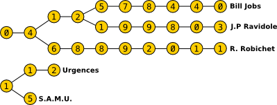

# Numero de telephone

## Instruction 

En rejoignant l’équipe de développement du smartphone iDroid, on vous a confié la responsabilité de développer le gestionnaire de contacts. 

Dans le gestionnaire de contact, le ou les numéros correspondant aux premiers chiffres saisis devront être affichés à l’utilisateur, quasi instantanément.


Un numero de telephone est composé de chiffres allant de `0` à `9` sans espace.

Malheureusement, le system iDroid posséde une capacité de mémoire limité. Le stockage en mémoire des numero doit etre optimisé.

La solution retenu est la suivante.

Les premiers chiffres communs aux numéros ne devront pas être dupliqués en mémoire. 
Le stockage s'effectue sous la forme d'un arbre comme representé ci dessous:



Par exemple, les numeros *0149499696* ,  *0149404545* ont les 5 premiers chiffres en commun. En memoire, il seront representés par l'arbre suivant:

```
                            9 -> 9 -> 6 -> 9 -> 6
                        /  
 O -> 1 -> 4 -> 9 -> 4  
                        \
                            0 -> 4 -> 5 -> 4 -> 5

```

Les numeros *911* ,  *115* n'ont pas chiffres en commun. En memoire, il seront representés par deux arbres distints:

```
9 -> 1 -> 1

1 -> 1 -> 5
```

> Le but l'exercice est écrire un programme qui retourne le nombre d'éléments (i.e le nombre de  noeud) nécessaires pour stocker une liste de numéros de téléphone


##  Exemples

| entré                    | sortie |
| -------------------------| ----------- |
| 0467123456               | 10       |
| 0123456789 , 1123456789  | 20        |
| 0123456789 , 0123        | 10        |